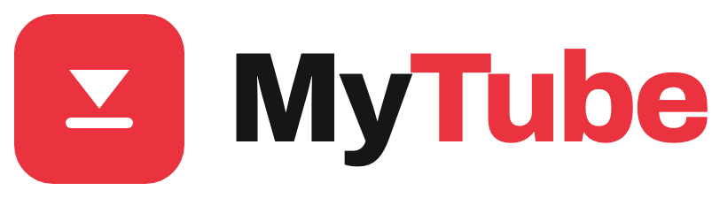
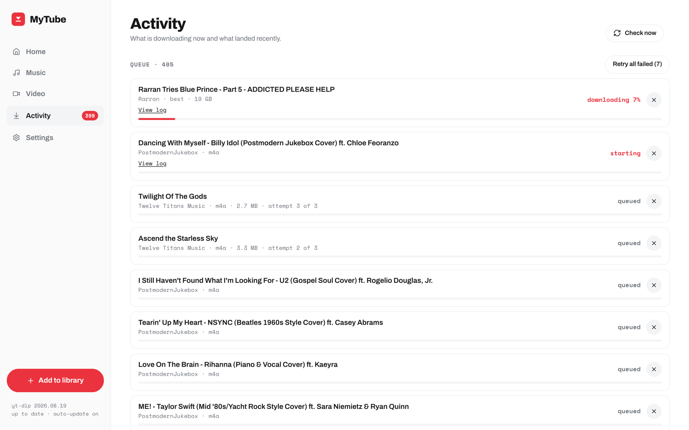
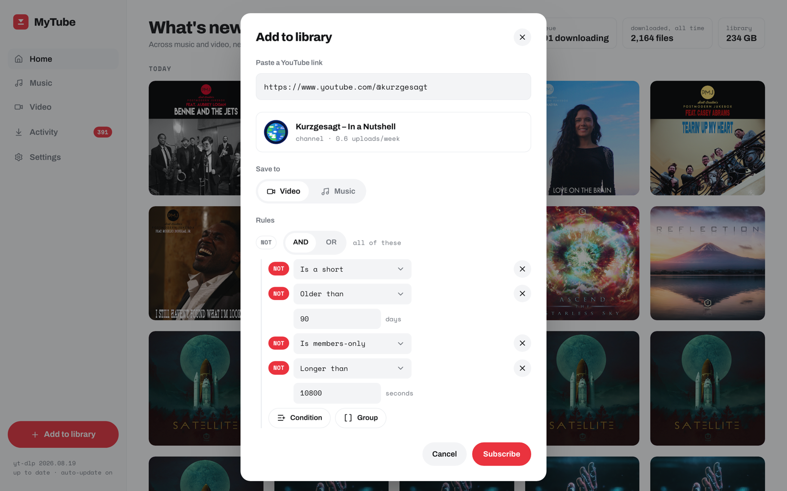
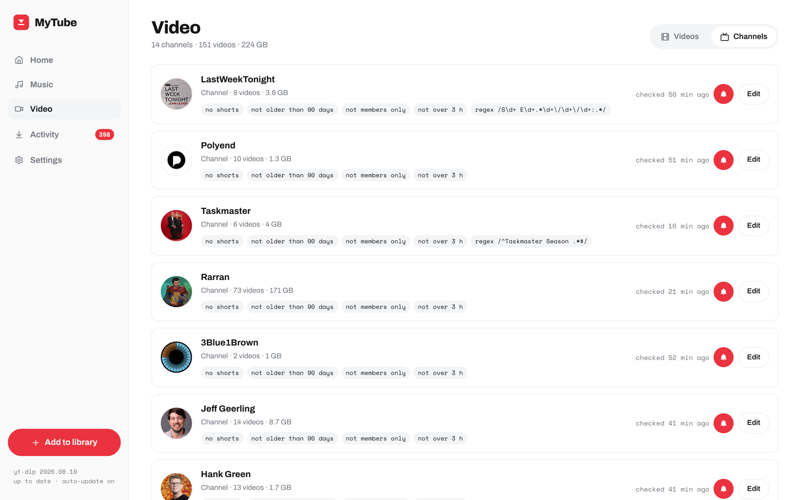
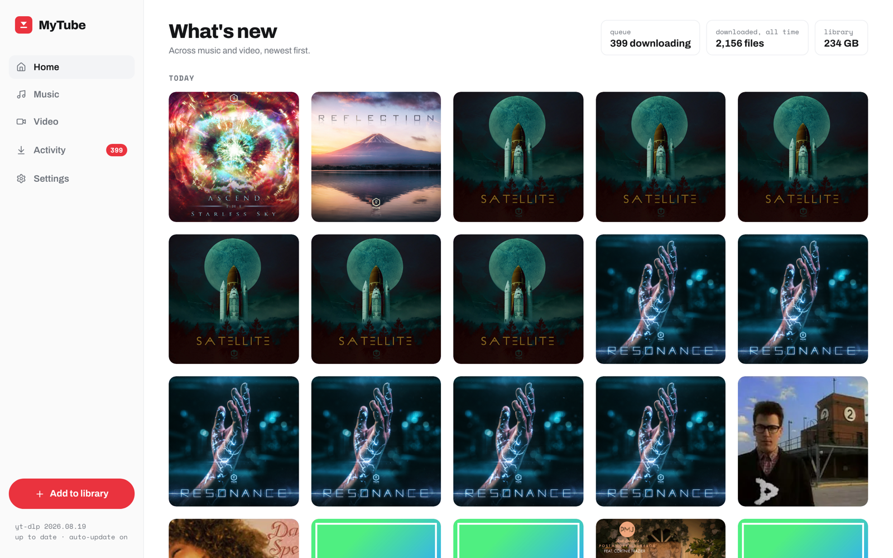
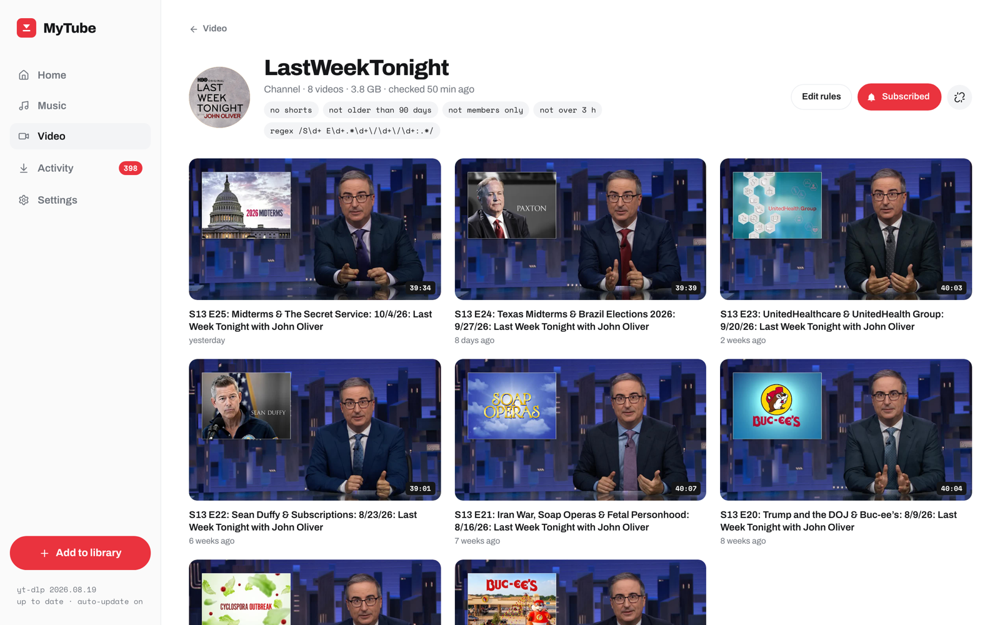
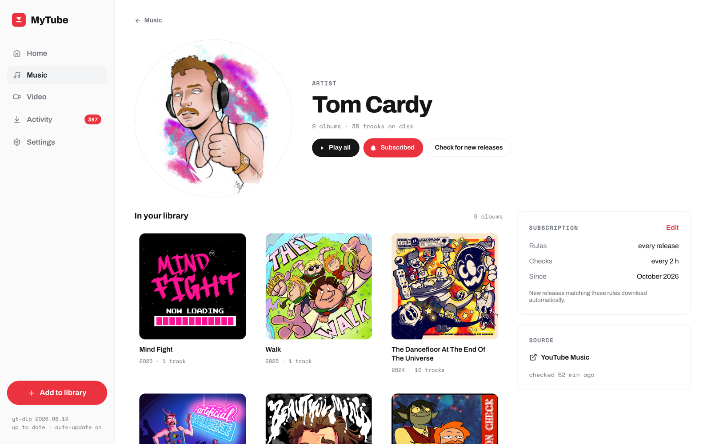

<p align="center">
  <picture>
    <source media="(prefers-color-scheme: dark)" srcset="docs/brand/lockup-dark.png">
    
  </picture>
</p>

<p align="center">
  <strong>Subscribe to channels and artists. Set rules. YouTube lands on your disk as plain files.</strong><br>
  No feed, no recommendations, no autoplay. One Docker container, three folders.
</p>

<p align="center">
  
  <a href="https://github.com/ChappIO/my-tube/releases"></a>
  <a href="https://github.com/ChappIO/my-tube/actions/workflows/ci.yml"></a>
  <a href="https://github.com/ChappIO/my-tube/pkgs/container/my-tube"></a>
  
  <a href="LICENSE"></a>
</p>

<p align="center">
  <a href="#install">Install</a> ·
  <a href="#first-run">First run</a> ·
  <a href="#rules">Rules</a> ·
  <a href="#what-ends-up-on-disk">On disk</a> ·
  <a href="#screenshots">Screenshots</a> ·
  <a href="#operating-it">Operating it</a> ·
  <a href="#alternatives">Alternatives</a>
</p>

> [!NOTE]
> **MyTube is in beta.** It has not seen enough time in production to be sure it is usable. By all means run it, and say what breaks or annoys you in the [issues](https://github.com/ChappIO/my-tube/issues).

<br>

<p align="center">
  <picture>
    <source media="(prefers-color-scheme: dark)" srcset="docs/screenshots/activity-dark.png">
    
  </picture>
</p>

## What it does

MyTube is a self-hosted downloader for people who want YouTube's content without YouTube's apps. You pick the channels, artists and playlists you actually want to follow. MyTube checks them on a schedule, runs every new upload through your rules, and downloads what passes with [yt-dlp](https://github.com/yt-dlp/yt-dlp). The result is two ordinary folders on your disk:

- **Music**: `Artist / Album / 01 Title.m4a`, tagged, with cover art embedded.
- **Video**: `Channel / Title (Date).mp4`, with the thumbnail and subtitles next to it.

Point Plex, Jellyfin, Kodi, a music player or a file browser at those folders and you are done. The web app exists to manage subscriptions and rules, watch the queue, read the history and change settings. It also has a player for a quick check, but the files are the product.

## Features

- **Subscriptions, not a feed.** Paste a channel, a YouTube Music artist or a playlist link. A single video link resolves to its channel. Nothing you did not subscribe to ever shows up.
- **Rules per subscription.** An AND/OR/NOT tree of conditions: no shorts, not older than 90 days, no members-only videos, no streams, shorter than 3 hours, title contains, title matches regex, published before or after a date, position in a playlist. Each library has its own defaults for new subscriptions.
- **Rules also decide what stays.** Tighten a rule and files that no longer match are removed on the next check. The editor shows what would go before you save. Nothing else ever deletes a file: unsubscribing, or removing a source, leaves the folder as it is.
- **Music done properly.** Artists come from YouTube Music with full albums, track numbers, release years and cover art. Tags are read from YouTube Music and enriched by MusicBrainz and Discogs. Missing tracks are counted and can be fetched per artist. Album covers are cached so they survive YouTube's expiring URLs.
- **Video the way players like it.** H.264 or VP9 in MP4 by default ("plays everywhere"), AV1 if you prefer small files. English subtitles embedded, auto-generated ones included if you want them. Thumbnails saved as sidecars.
- **Your folder layout.** Path templates for both libraries, with the variables you would expect (`{artist}`, `{album}`, `{track:02}`, `{channel}`, `{date}`, …).
- **Hands off.** Checks every 2 hours by default. yt-dlp is downloaded on first start and updated every 6 hours without a new image. Nightly database backup and library rescan.
- **Honest about failures.** A queue with progress, speed and ETA, per-job yt-dlp logs, three attempts per download, a one-click retry for everything that failed. A Music Premium-only track is marked unavailable instead of retried forever.
- **Cookies only when needed.** Downloads run without cookies first. A `cookies.txt` is used only when YouTube asks for a sign-in or a bot check.
- **One container.** Node, SQLite, yt-dlp and ffmpeg inside. Three mounts outside. `linux/amd64` and `linux/arm64`.

## Install

```yaml
# docker-compose.yml
services:
  mytube:
    image: ghcr.io/chappio/my-tube:latest
    container_name: mytube
    ports:
      - '8080:8080'
    environment:
      PUID: 1000
      PGID: 1000
      TZ: Europe/Amsterdam
    volumes:
      - ./config:/config
      - /srv/media/music:/media/music
      - /srv/media/video:/media/video
    restart: unless-stopped
```

```bash
docker compose up -d
```

Open `http://your-host:8080`.

### Mounts

| Path           | Holds                                                                                                                       |
| -------------- | --------------------------------------------------------------------------------------------------------------------------- |
| `/config`      | The database (settings included), backups, logs, the yt-dlp binary, the artwork cache and an optional `cookies.txt`. Small. |
| `/media/music` | The Music library. Point your player's music library here.                                                                  |
| `/media/video` | The Video library. Point your player's video or "other videos" library here.                                                |

Only `/config` is chowned to `PUID:PGID` on start. The media folders are left alone, so make sure that user can write to them.

### Environment

| Variable | Default | Meaning                                                                                                      |
| -------- | ------- | ------------------------------------------------------------------------------------------------------------ |
| `PUID`   | `1000`  | User id MyTube runs as; downloaded files are owned by it. Use the id that owns your media folders (`id -u`). |
| `PGID`   | `1000`  | Group id, likewise (`id -g`).                                                                                |
| `TZ`     | UTC     | Time zone for the nightly backup (04:00), the nightly rescan (04:30) and the log.                            |
| `PORT`   | `8080`  | Port inside the container. Changing the published port (`'9000:8080'`) is usually enough.                    |

### Image tags

| Tag      | What                                              |
| -------- | ------------------------------------------------- |
| `latest` | The newest release.                               |
| `1.2`    | The newest patch of a minor release. Pin to this. |
| `1.2.3`  | One release (the `v1.2.3` tag on GitHub).         |

### No authentication

> [!WARNING]
> MyTube has no login. Anyone who can reach the port can add sources, change rules and delete files. Keep it on your home network, or put it behind a reverse proxy that authenticates (Authelia, Authentik, basic auth, Tailscale, …). Do not expose it to the internet as is.

## First run

1. Open the app. On first start it downloads the latest yt-dlp into `/config/bin`; the sidebar footer shows the version once that is done.
2. Click **Add to library** and paste a link: a channel (`https://www.youtube.com/@NASA`), an artist on YouTube Music (`https://music.youtube.com/channel/…`) or a playlist. Choose **Video** or **Music**.
3. Check the rules. New subscriptions start from the defaults in Settings → Video or Settings → Music. Change them here for this source only.
4. **Subscribe.** The source is checked at once and then every 2 hours. Downloads appear in Activity.
5. Point Plex, Jellyfin or your music player at the two library folders.

<p align="center">
  <picture>
    <source media="(prefers-color-scheme: dark)" srcset="docs/screenshots/add-to-library-dark.png">
    
  </picture>
</p>

## Rules

Every subscription has a matcher: a tree of **AND**, **OR** and **NOT** groups around conditions. A new upload is downloaded when the tree matches it, and an existing file is kept as long as it still matches.

| Condition                       | Matches when                                      |
| ------------------------------- | ------------------------------------------------- |
| Is a short                      | the video is a YouTube Short                      |
| Is members-only                 | the video requires a channel membership           |
| Live status                     | the video is a live stream, was one, or never was |
| Older than N days               | published more than N days ago                    |
| Published before / after a date | published before or after a date you set          |
| Shorter / longer than N seconds | duration under or over a limit                    |
| Title contains                  | the title contains a text, case-insensitive       |
| Title matches regex             | the title matches a regular expression            |
| Channel is                      | the uploader (for playlists that mix channels)    |
| Position in playlist under N    | the item is in the first N of a playlist          |

Most conditions are used inside a **NOT**: the default Video rules are "NOT a short, NOT older than 90 days, NOT members-only, NOT longer than 3 hours". A regex on the title turns a busy channel into just its weekly show.

When rules get stricter, the files that no longer match are removed on the next check, and the Edit rules dialog tells you how many before you save. This is the only way MyTube ever deletes anything. Removing a source or turning its bell off never touches the disk.

<p align="center">
  <picture>
    <source media="(prefers-color-scheme: dark)" srcset="docs/screenshots/channels-dark.png">
    
  </picture>
</p>

## What ends up on disk

| Library | Default path                              | Format                                                                                                                                                 |
| ------- | ----------------------------------------- | ------------------------------------------------------------------------------------------------------------------------------------------------------ |
| Music   | `{artist}/{album}/{track:02} {title}.m4a` | Best audio, M4A by default (or Opus, MP3, FLAC), tagged (artist, album, track, year), cover art embedded. Optional loudness normalization to -14 LUFS. |
| Video   | `{channel}/{title} ({date}).mp4`          | Best quality, H.264/VP9 or AV1 (your choice), subtitles embedded, `Title (Date).jpg` thumbnail next to it.                                             |

Both templates are editable in Settings. Plex and Jellyfin read these layouts without any agent or plugin: a Music library for `/media/music`, an "Other videos" or Home videos library for `/media/video`.

Files MyTube does not know about are left alone. Delete or move something outside the app and it shows as **missing** after the nightly rescan (or a manual one); put it back and it is **on disk** again.

## Screenshots

<table>
  <tr>
    <td width="50%"><picture>
    <source media="(prefers-color-scheme: dark)" srcset="docs/screenshots/home-dark.png">
    
  </picture></td>
    <td width="50%"><picture>
    <source media="(prefers-color-scheme: dark)" srcset="docs/screenshots/channel-dark.png">
    
  </picture></td>
  </tr>
  <tr>
    <td align="center"><sub>Home: what landed, newest first, with the queue and library totals.</sub></td>
    <td align="center"><sub>A channel: its rules, its bell, its videos on disk.</sub></td>
  </tr>
  <tr>
    <td width="50%"><picture>
    <source media="(prefers-color-scheme: dark)" srcset="docs/screenshots/artist-dark.png">
    
  </picture></td>
    <td width="50%"><picture>
    <source media="(prefers-color-scheme: dark)" srcset="docs/screenshots/activity-dark.png">
    
  </picture></td>
  </tr>
  <tr>
    <td align="center"><sub>An artist from YouTube Music: albums on disk, missing tracks queued.</sub></td>
    <td align="center"><sub>Activity: what is downloading and what landed.</sub></td>
  </tr>
</table>

The app follows your system theme, and so do these screenshots: GitHub shows the light or the dark set to match yours.

## Operating it

### Where things are

| What                  | Where                                                                                                                                            |
| --------------------- | ------------------------------------------------------------------------------------------------------------------------------------------------ |
| Application log       | `/config/logs/mytube.log` (rotated at 5 MB, three kept), also on stdout (`docker logs mytube`), also Settings → Advanced → **Download logs**.    |
| yt-dlp output per job | `/config/logs/jobs/<job id>.log`, the newest 200. **View log** on any queue or history entry.                                                    |
| Database and settings | `/config/mytube.db`                                                                                                                              |
| Backups               | `/config/backups/mytube-<time>.sqlite`, nightly at 04:00 and on **Back up now** in Settings → Advanced. The newest 7 are kept.                   |
| yt-dlp                | `/config/bin/yt-dlp`, checked every 6 hours and replaced automatically. Settings → Advanced shows the version and lets you turn auto-update off. |
| Cookies (optional)    | `/config/cookies.txt`, owner-only, not in backups. See below.                                                                                    |

### Health check

`GET /api/health` answers `{"status":"ok","version":…}`. The image has a `HEALTHCHECK`, so `docker ps` shows `healthy` once the app is up.

### Cookies

Downloads run without cookies first. If YouTube answers with a sign-in or bot check, MyTube retries that call with your cookies, if you gave it any: Settings → Advanced → Network → Cookies, **Upload** or **Paste** a `cookies.txt` exported from your browser (the dialog has the steps), or mount your own file and type its path. Signed-in sessions lose formats without a PO token, so if downloads start failing with "Requested format is not available", remove the cookies again.

### Update

```bash
docker compose pull && docker compose up -d
```

The database is migrated on start. yt-dlp updates itself inside `/config` and never needs a new image.

### Restore a backup

1. Stop the container: `docker compose stop mytube`.
2. Copy the backup over the database and remove the two WAL files next to it:

   ```bash
   cp config/backups/mytube-2026-09-26T04:00:00Z.sqlite config/mytube.db
   rm -f config/mytube.db-wal config/mytube.db-shm
   ```

3. Start it again: `docker compose start mytube`.

The backup holds everything MyTube knows: sources, rules, settings, the library index and the history. Media files and the cookies file are not in it. After restoring an older backup, run **Rescan libraries** in Settings → Advanced so the on-disk flags match the folders.

## Alternatives

MyTube is opinionated: two libraries, a rule tree, plain folders, no accounts. If you want something else, these are good:

- [Pinchflat](https://github.com/kieraneglin/pinchflat): downloader with presets, RSS feeds and Apprise notifications.
- [Tube Archivist](https://github.com/tubearchivist/tubearchivist): archive and index, with search and an in-app player, on Elasticsearch.
- [ytdl-sub](https://github.com/jmbannon/ytdl-sub): config-file driven, extremely flexible, no web UI.
- [TubeSync](https://github.com/meeb/tubesync): channel and playlist sync to a media server.

## License

[MIT](LICENSE).

## Contributing

Start with [`CLAUDE.md`](CLAUDE.md). Conventions and the design reference live in the skills under `.claude/skills`. `pnpm dev` starts the API and the web app; `pnpm check` runs what CI runs.
