<p align="center">
  <picture>
    <source media="(prefers-color-scheme: dark)" srcset="docs/logo-dark.png">
    
  </picture>
</p>

<p align="center">
  A self-hosted library for the YouTube channels and artists you chose.<br>
  No feed, no recommendations, no autoplay. Just your subscriptions, on your disk, in Plex.
</p>

<p align="center">
  <a href="https://github.com/ChappIO/my-tube/actions/workflows/ci.yml"></a>
  <a href="https://github.com/ChappIO/my-tube/releases"></a>
  <a href="https://github.com/ChappIO/my-tube/pkgs/container/my-tube"></a>
</p>

<p align="center">
  <picture>
    <source media="(prefers-color-scheme: dark)" srcset="docs/screenshots/home-dark.png">
    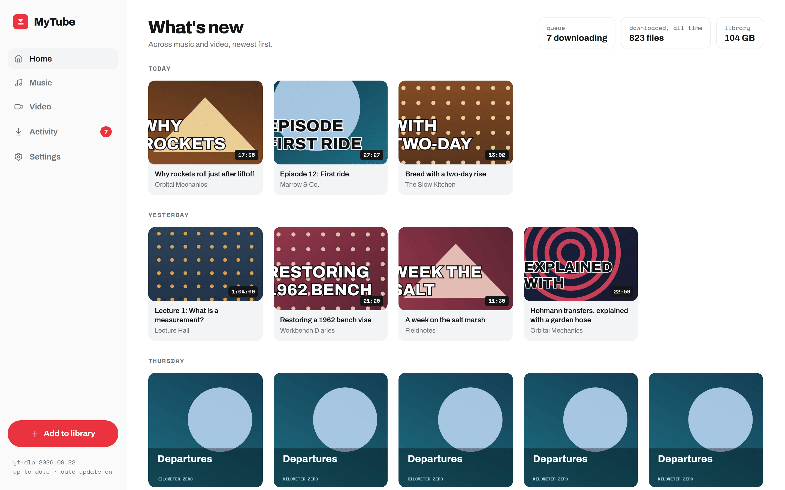
  </picture>
</p>

## What it is

YouTube decides what you watch next. MyTube does not. You paste a link to a channel, an artist or a playlist, set a few rules, and MyTube checks it on a schedule and downloads what matches. Nothing else ever shows up.

Everything lands in two plain folders: a **Music** library (artist, album, track, tagged, with cover art) and a **Video** library (channel, video, with a thumbnail next to it). Point Plex, Jellyfin or any music player at those folders and you have a YouTube you control. The web app is for managing subscriptions, watching the queue, reading the history, changing settings and a quick listen or watch in the browser.

It runs as one Docker container with three mounts.

## Features

- **Subscriptions, not a feed.** Channels, YouTube Music artists and playlists. A single video link resolves to its channel. Mixes, liked videos and watch later are not addable on purpose.
- **Rules per subscription.** An AND / OR / NOT tree of conditions: no shorts, not older than 90 days, no members-only videos, title contains, longer than, published after, and more. The same rules decide what is downloaded and what stays: tighten them and files that no longer match are removed.
- **Two libraries.** Music is filed as `Artist / Album / 01 Title.m4a` with tags and embedded cover art. Video is filed as `Channel / Title (Date).mp4` with a thumbnail sidecar. Both templates are editable.
- **Artists are their releases.** An artist subscription downloads every album and single from YouTube Music. Releases the rules skip are still listed, one click away.
- **Plex-ready.** Files, tags and thumbnails are laid out for Plex. There is nothing to integrate.
- **A queue you can see.** Progress, speed, size and the full yt-dlp log of every download. Retries back off on their own.
- **yt-dlp keeps itself current.** Downloaded on first start and updated every few hours. YouTube changes; you do not rebuild the image.
- **Nightly care.** A database backup at 04:00, a library rescan at 04:30 that notices files you moved or deleted outside the app.
- **In-browser player.** A queue, a visualizer for music, a video player with subtitles. Playback of your files, not a stream from YouTube.
- **Light and dark.** Follows your device, or pick one.
- **Never deletes on its own.** Unsubscribing, removing a source or turning a bell off never touches files. Only a subscription's rules do.

## Screenshots

The library in the screenshots is a demo. The channels, artists and albums are made up.

<table>
  <tr>
    <td width="50%">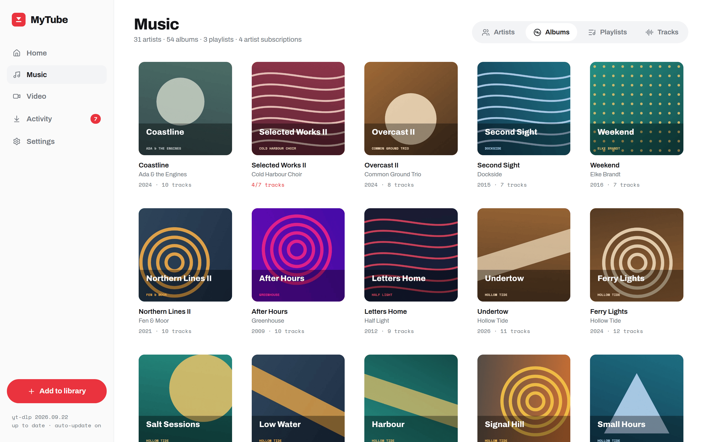</td>
    <td width="50%">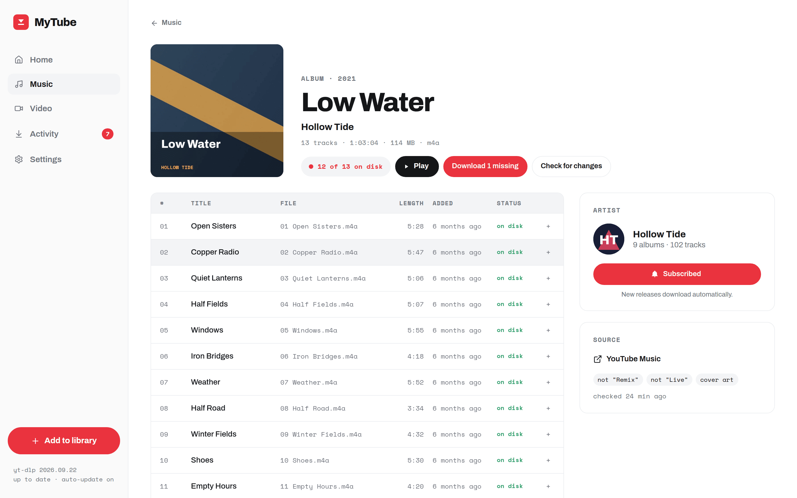</td>
  </tr>
  <tr>
    <td align="center">Music: albums, with incomplete ones marked</td>
    <td align="center">An album: tracks, files, and what is missing</td>
  </tr>
  <tr>
    <td>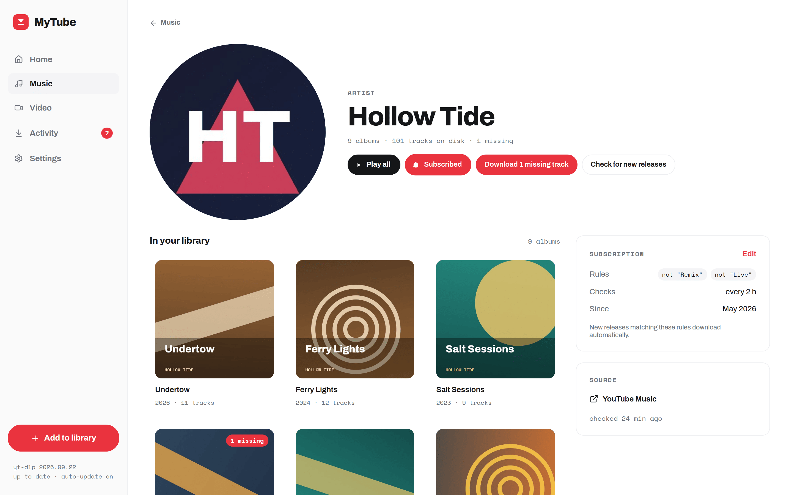</td>
    <td>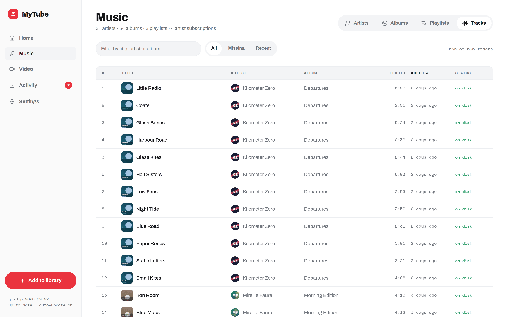</td>
  </tr>
  <tr>
    <td align="center">An artist: releases in your library and the ones the rules skipped</td>
    <td align="center">Every track, filterable and sortable</td>
  </tr>
  <tr>
    <td>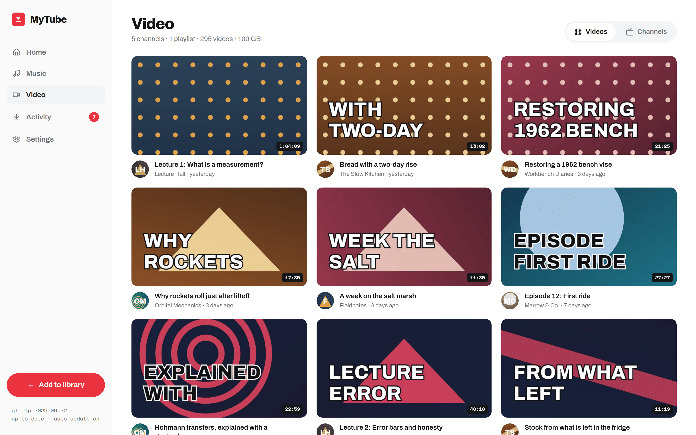</td>
    <td>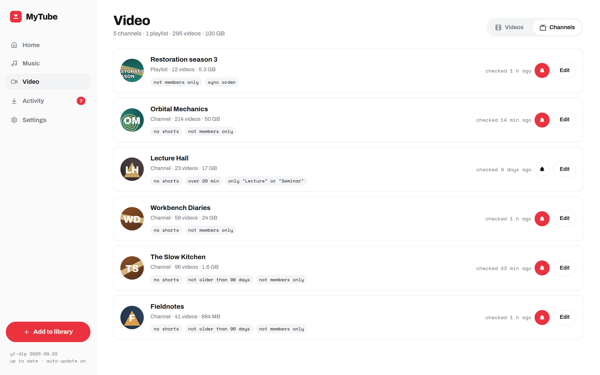</td>
  </tr>
  <tr>
    <td align="center">Video: newest first, from every channel</td>
    <td align="center">Channels and playlists, with their rules as chips</td>
  </tr>
  <tr>
    <td>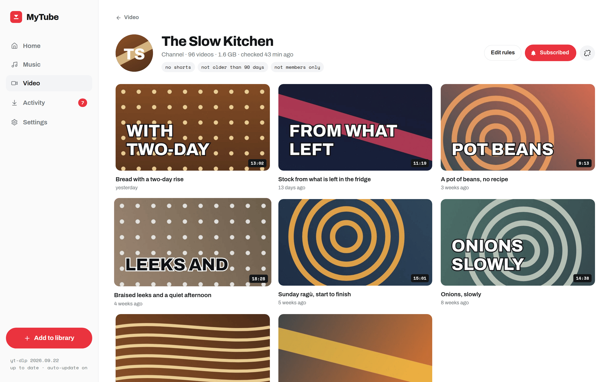</td>
    <td>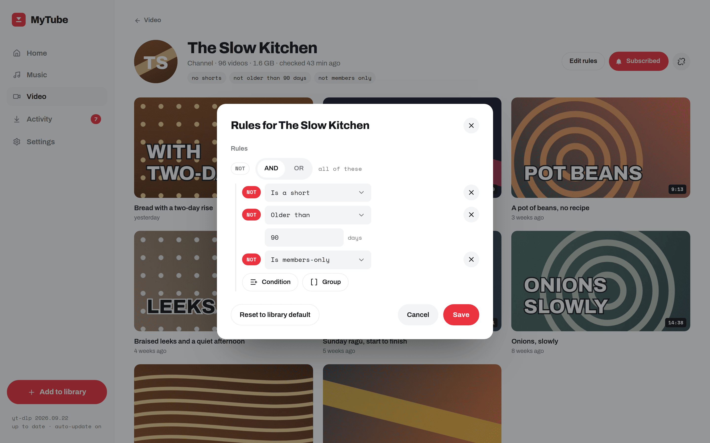</td>
  </tr>
  <tr>
    <td align="center">A channel</td>
    <td align="center">The rule builder: AND, OR, NOT over plain conditions</td>
  </tr>
  <tr>
    <td>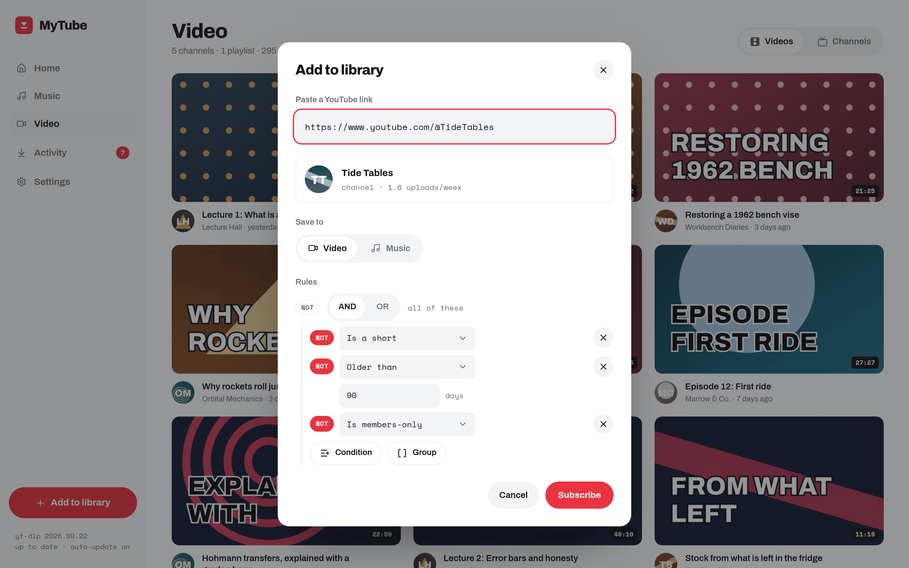</td>
    <td>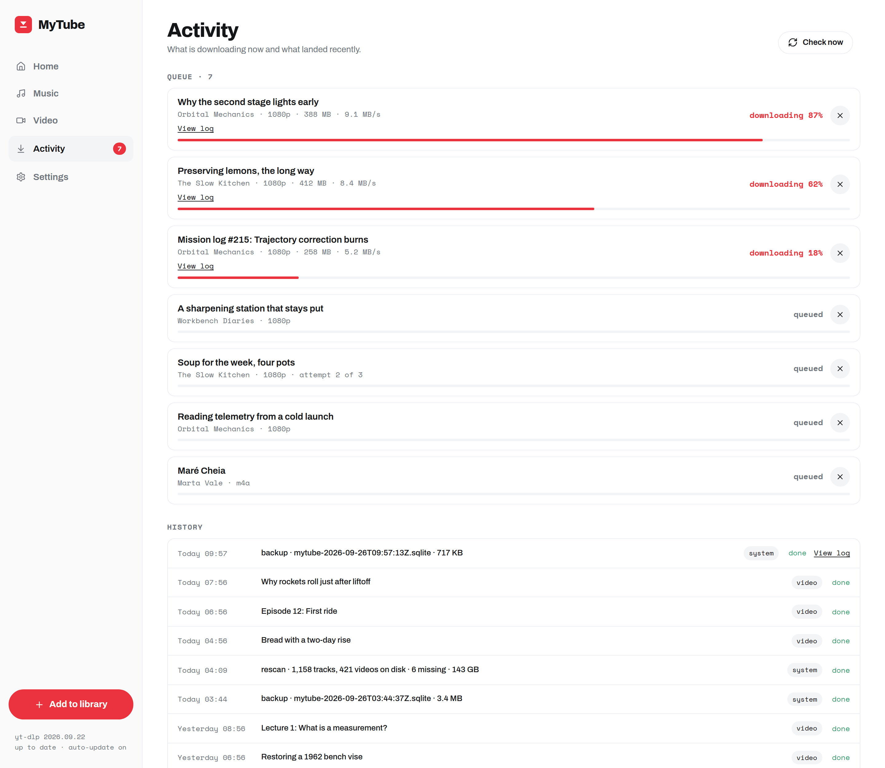</td>
  </tr>
  <tr>
    <td align="center">Add to library: paste a link, pick a library, set the rules</td>
    <td align="center">Activity: the queue with progress and the history below it</td>
  </tr>
  <tr>
    <td>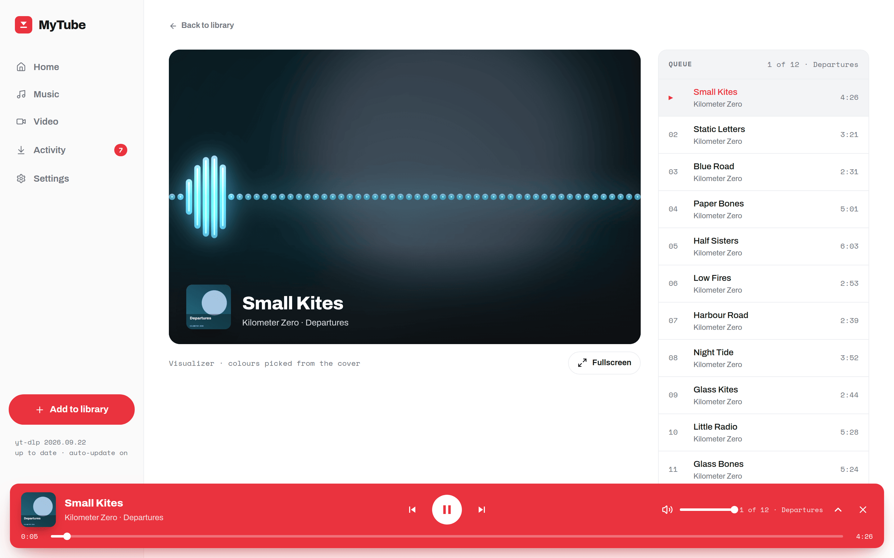</td>
    <td>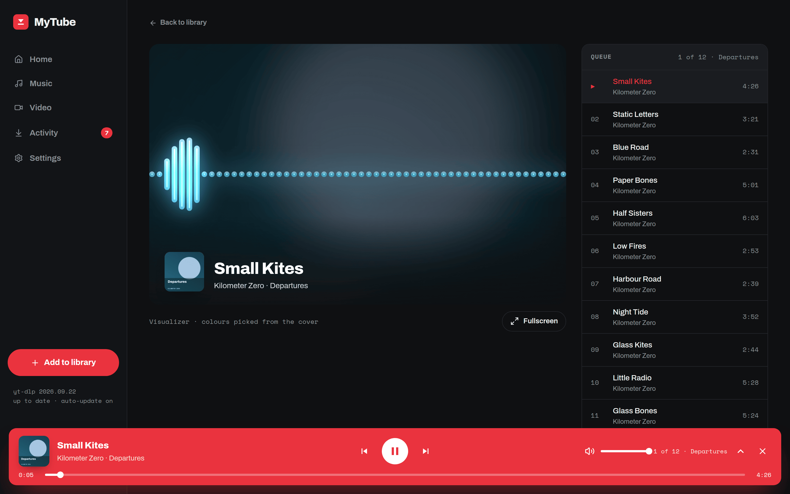</td>
  </tr>
  <tr>
    <td align="center">Now Playing</td>
    <td align="center">The same, in dark</td>
  </tr>
  <tr>
    <td>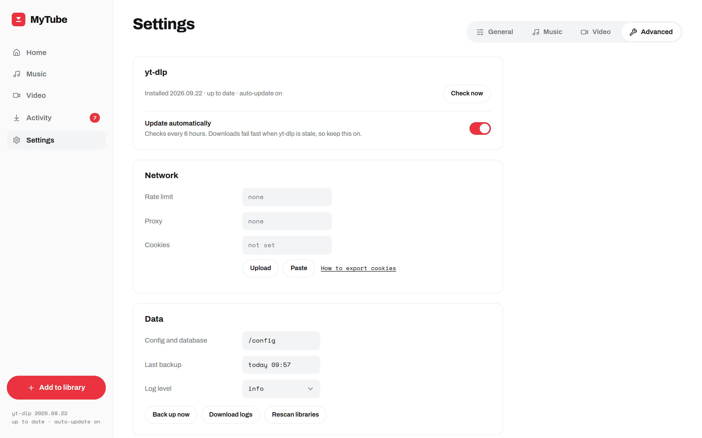</td>
    <td></td>
  </tr>
  <tr>
    <td align="center">Settings: yt-dlp, network, cookies, backups, logs</td>
    <td></td>
  </tr>
</table>

## Install

You need Docker with Compose and two folders for the libraries. Save this as `docker-compose.yml`:

```yaml
services:
  mytube:
    image: ghcr.io/chappio/my-tube:latest
    container_name: mytube
    ports:
      - '8080:8080'
    environment:
      PUID: 1000
      PGID: 1000
      TZ: Europe/Amsterdam
    volumes:
      - ./config:/config
      - /srv/media/music:/media/music
      - /srv/media/video:/media/video
    restart: unless-stopped
```

Change the two media paths to your own, then:

```bash
docker compose up -d
```

Open http://your-host:8080.

### Image tags

| Tag      | What                                              |
| -------- | ------------------------------------------------- |
| `latest` | The newest release.                               |
| `1.2.3`  | One release (the `v1.2.3` tag on GitHub).         |
| `1.2`    | The newest patch of a minor release. Pin to this. |

Images are built for `linux/amd64` and `linux/arm64`.

### Mounts

| Path           | Holds                                                                                                                                    |
| -------------- | ---------------------------------------------------------------------------------------------------------------------------------------- |
| `/config`      | The database (`mytube.db`, settings included), backups, logs, the yt-dlp binary, the artwork cache and an optional `cookies.txt`. Small. |
| `/media/music` | The Music library: `Artist / Album / ## Title.m4a`. Point Plex's music library here.                                                     |
| `/media/video` | The Video library: `Channel / Title (Date).mp4` with `Title (Date).jpg` next to it. Point Plex's video library here.                     |

The folder structure and file formats are editable in Settings → Music and Settings → Video.

### Environment

| Variable | Default | Meaning                                                                                                                             |
| -------- | ------- | ----------------------------------------------------------------------------------------------------------------------------------- |
| `PUID`   | `1000`  | User id MyTube runs as. Files in the libraries and in `/config` are owned by it. Use the id that owns your media folders (`id -u`). |
| `PGID`   | `1000`  | Group id, likewise (`id -g`).                                                                                                       |
| `TZ`     | UTC     | Time zone for the nightly backup (04:00) and rescan (04:30) and for the log. Any tz database name.                                  |
| `PORT`   | `8080`  | Port inside the container. Changing the published port (`'9000:8080'`) is usually enough.                                           |

Only `/config` is chowned to `PUID:PGID` on start. The media folders are left as they are, so make sure that user can write to them.

### Health check

`GET /api/health` answers `{"status":"ok","version":…}`. The image has a `HEALTHCHECK` on it, so `docker ps` shows `healthy` once the app is up.

### No authentication

MyTube has no login. Anyone who can reach the port can add sources, change rules and delete files. Keep it on your home network, or put it behind a reverse proxy that does authentication (Authelia, Authentik, basic auth, Tailscale, …). Do not expose it to the internet as is.

## First run

1. Open the app. On first start it downloads the latest yt-dlp into `/config/bin`. The sidebar footer shows its version once that is done.
2. Click **Add to library** and paste a YouTube link: a channel (`https://www.youtube.com/@NASA`), an artist on YouTube Music (`https://music.youtube.com/channel/…`) or a playlist. Choose Video or Music.
3. Set the rules before you subscribe. New sources start from the defaults in Settings → Video and Settings → Music. The Video default is: no shorts, not older than 90 days, no members-only videos. The Music default is: everything.
4. Subscribe. The source is checked at once and then every 2 hours. Downloads show up in Activity.
5. Point Plex (or Jellyfin, or a music player) at the two library folders.

## How the rules work

Every subscription has one rule tree. At each check, an item the tree matches is downloaded and one it does not match is skipped. Every 6 hours, and right after you save new rules, the files on disk are checked against the tree again, and a file the current rules no longer match is removed. That is the only time MyTube deletes anything by itself.

So "keep the last 90 days of this channel" is the rule `NOT older than 90 days`. New uploads come in, and each file leaves the library once it turns 91 days old. Before saving, the Edit rules dialog shows which files would go.

Conditions: title contains, title matches (regex), is a short, is members-only, published before or after a date, older than N days, duration under or over, live status, and for playlists, the uploading channel and the playlist position. Combine them with AND, OR and NOT groups.

An album you download by hand from an artist page is pinned. The rules leave it alone until you unpin it.

## Where things are

| What                  | Where                                                                                                                                                                                                                                                                                                                                                                                                                                                                                                                                                                   |
| --------------------- | ----------------------------------------------------------------------------------------------------------------------------------------------------------------------------------------------------------------------------------------------------------------------------------------------------------------------------------------------------------------------------------------------------------------------------------------------------------------------------------------------------------------------------------------------------------------------- |
| Application log       | `/config/logs/mytube.log` (rotated at 5 MB, three old files kept), also on stdout (`docker logs mytube`). Settings → Advanced → **Download logs**.                                                                                                                                                                                                                                                                                                                                                                                                                      |
| yt-dlp output per job | `/config/logs/jobs/<job id>.log`, the newest 200. Linked from the Activity queue and history (**View log**).                                                                                                                                                                                                                                                                                                                                                                                                                                                            |
| Database and settings | `/config/mytube.db`                                                                                                                                                                                                                                                                                                                                                                                                                                                                                                                                                     |
| Backups               | `/config/backups/mytube-<time>.sqlite`: every night at 04:00, and on **Back up now** in Settings → Advanced. The newest 7 are kept.                                                                                                                                                                                                                                                                                                                                                                                                                                     |
| yt-dlp                | `/config/bin/yt-dlp`. Checked for updates every 6 hours and replaced automatically (Settings → Advanced).                                                                                                                                                                                                                                                                                                                                                                                                                                                               |
| Cookies (optional)    | If YouTube asks for a sign-in or a bot check: Settings → Advanced → Network → Cookies, **Upload** or **Paste** a cookies.txt exported from your browser (**How to export cookies** there has the steps). MyTube keeps it as `/config/cookies.txt`, owner-only, not in backups. Or mount your own file and type its path in the same row. Cookies are used only when YouTube asks for a sign-in (a call runs without them first); signed-in sessions lose formats without a PO token, so if downloads fail with "Requested format is not available", remove the cookies. |

Every night at 04:30 MyTube rescans both libraries: a file you deleted or moved outside the app shows as missing, a file that came back shows as on disk again, and the library sizes in Settings are recounted. Files MyTube does not know are counted in the history entry and left alone. **Rescan libraries** in Settings → Advanced does the same at once.

## Backup and restore

The nightly backup is a copy of the database. It holds everything MyTube knows: sources, rules, settings, the library index and the history. Media files and the cookies file are not in it, so back those up the way you back up the rest of your media.

To restore one:

1. Stop the container: `docker compose stop mytube`.
2. In your config folder, copy the backup over the database and remove the two WAL files next to it:

   ```bash
   cp config/backups/mytube-2026-09-26T04:00:00Z.sqlite config/mytube.db
   rm -f config/mytube.db-wal config/mytube.db-shm
   ```

3. Start it again: `docker compose start mytube`.

After restoring an older backup, run **Rescan libraries** so the on-disk flags match the folders. Export cookies again after a restore on a new machine.

## Update

```bash
docker compose pull && docker compose up -d
```

The database is migrated on start. yt-dlp updates itself inside `/config` and does not need a new image.

## Development

MyTube is a pnpm workspace: a NestJS API (`packages/api`), a Vite + React web app (`packages/web`) and the Zod schemas they share (`packages/shared`). SQLite holds everything; yt-dlp and ffmpeg do the work.

```bash
nvm use            # Node 24, see .nvmrc
pnpm install
pnpm dev           # API on :8080, web on :5173, data in .local/
pnpm check         # lint, format, typecheck, tests: what CI runs
```

`docker compose up --build` runs the production image locally with `.local/` as its mounts.

## Contributing

Start with [`CLAUDE.md`](CLAUDE.md). The conventions and the design reference live in the skills under `.claude/skills`, one per area: architecture, backend, database, frontend, tooling and deployment. Changes ship as one pull request each, validated in the browser before pushing.
